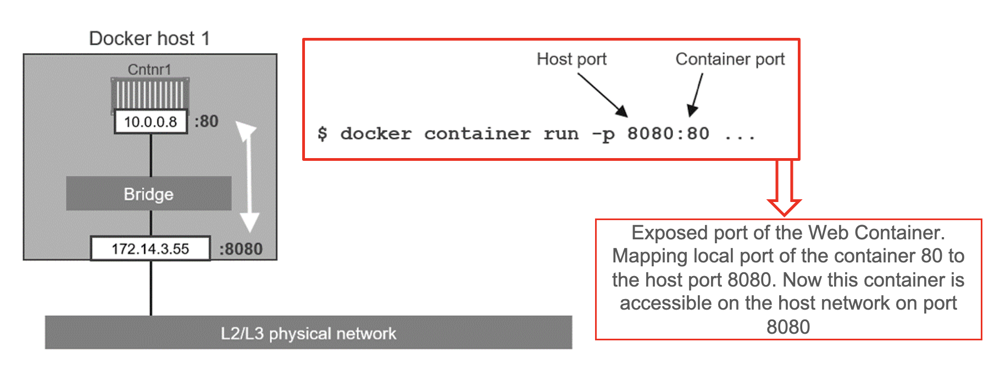

# Docker Fundamentals
A gentle introduction to Docker, containers creation and management, 
and containerized development.

## Course Goals
The course contained in this repository is meant to provide a basic understanding 
of Docker principles, how it works, how to create, manage and run containers, 
and how to develop a container for a personal application. 
It offers a hands-on experience with Docker commands, Dockerfiles, and container 
management including also a brief presentation of Docker Compose.

## TOC
The outline of the course is as follows: 
- [Virtual Machines & Containers](#virtual-machines--containers)
  - [Virtual Machines](#virtual-machines)
  - [Containers](#containers)
  - [Key Differences & Comments](#key-differences--comments)
  - [Container History & First Experiments](#container-history--first-experiments)
- [Docker](#docker)
  - [Installing Docker](#installing-docker)
  - [Create First Container](#create-first-container)
  - [Create an Ubuntu Container](#create-an-ubuntu-container)
  - [Local Development & Working Environment](#local-development--working-environment)
  - [Docker Containers Working Modes](#docker-containers-working-modes)
  - [List Running Containers](#list-running-containers)
  - [Stop Containers](#stop-containers)
  - [List Stopped Containers](#list-stopped-containers)
  - [View the Last Started Container](#view-the-last-started-container)
  - [View Containers Logs](#view-containers-logs)
  - [Restart Containers](#restart-containers)
  - [Containers vs Images](#containers-vs-images)
  - [Object-Oriented Programming & Containers](#object-oriented-programming--containers)
  - [Creating a New Image](#creating-a-new-image)
  - [Images History](#images-history)
  - [Building & Caching](#building--caching)
  - [Namespaces & Images Management](#namespaces--images-management)
  - [Listing Available Images](#listing-available-images)
  - [Searching for Images](#searching-for-images)
  - [Downloading Images](#downloading-images)
  - [Images & Tags](#images-and-tags)
  - [Images and Multiple Architecture](#images-and-multiple-architectures)
  - [Networking](#networking)
  - [Volumes](#volumes)
  - [Docker Compose](#docker-compose)
- [Build Our First Docker Application](#build-our-first-docker-application)
  - [Dockerfile](#dockerfile)
  - [Build the Container](#build-the-container)
  - [Run the Container](#run-the-container)
  - [Run the Container with Configuration File](#run-the-container-with-configuration-file)
  - [Stop & Remove the Container](#stop--remove-the-container)

---

## Virtual Machines & Containers


In the world of virtualization and cloud computing, 
two primary technologies are widely used: **Virtual Machines (VMs)** and **Containers**. 
Both have their unique characteristics and different use cases. 
Understanding the differences between them is essential for choosing 
the right technology for your infrastructure needs.
Additional information and references can be found at the following link:
[https://www.atlassian.com/microservices/cloud-computing/containers-vs-vms](https://www.atlassian.com/microservices/cloud-computing/containers-vs-vms)


### Virtual Machines

Virtual Machines (VMs) are software-based emulations of physical computers that run 
on a physical host machine.
Their main characteristics are:

1. **Hypervisor-Based**: VMs run on a hypervisor, which can be either Type 1 
(bare-metal) or Type 2 (hosted).
2. **Complete OS**: Each VM includes a full operating system (guest OS) along 
with the application and its dependencies.
3. **Isolation**: VMs provide strong isolation between different VMs as each VM runs 
a separate OS.
4. **Resource Allocation**: VMs require more system resources (CPU, memory, storage) 
because each VM runs its own OS.
5. **Boot Time**: VMs typically have longer boot times compared to containers 
because they need to boot the entire OS.

> [!NOTE]
> - Bare metal hypervisors: 
>   - VMs execute directly on the hardware, without the need of an underlying 
operating system. 
>   - They have direct access to underlying physical resources 
(CPU, RAM, memory, network). 
>   - Examples: VMware ESXi, MS Hyper-V, Xen, KVM. 
> - Host hypervisors: 
>   - VMs execute on top of an existing OS. It introduces some overhead. 
>   - Examples: VMware Workstation, VirtualBox, Parallels desktop.

VMs change the way we think about hardware and software and open up new 
possibilities for IT infrastructure.
They are widely used in various scenarios, including:

- Running applications that require strong isolation.
- Legacy application support that requires a specific OS.
- Multi-tenant environments where security and isolation are priorities.
- Running different operating systems on the same physical hardware.


### Containers

On the other hand, Containers are a form of operating system-level virtualization 
that allows multiple isolated **user-space instances** to run on a single host OS.
User-space instance means that each container runs as a separate process in the host OS, instead of booting a full OS like VMs.
This approach provides a lightweight and efficient way to run applications in isolated environments without the overhead of a full OS.
A container is a lightweight, standalone, and executable package that includes the application and its dependencies and 
that uses shared resources from the host OS and a layered file system. The main characteristics of containers are:

1. **Lightweight**: Containers share the host OS kernel and are much more lightweight than VMs.
2. **Fast Boot Time**: Containers can start almost instantly as they do not require booting an entire OS.
3. **Resource Efficiency**: Containers use fewer resources since they share the host OS and libraries.
4. **Portability**: Containers package the application and its dependencies, making them portable across different environments.
5. **Isolation**: Containers provide process-level isolation using namespaces and control groups (cgroups).

The rise of containers has transformed the way we develop, deploy, and manage applications.
In particular they enabled the following use cases:

- **Microservices architectures** where each service runs in its own container.
- **Continuous Integration/Continuous Deployment** (CI/CD) pipelines.
- **Running multiple instances** of the same application.
- **Developing and testing environments** due to easy reproducibility.


### Key Differences & Comments

Some of the main differences between Virtual Machines and Containers are summarized in the table below:

| Feature              | Virtual Machines                   | Containers                                            |
|----------------------|------------------------------------|-------------------------------------------------------|
| **Isolation**        | Full OS isolation                  | Process-level isolation                               |
| **Boot Time**        | Minutes                            | Seconds                                               |
| **Resource Usage**   | High (full OS per VM)              | Low (shared OS kernel)                                |
| **Performance**      | Lower due to overhead of hypervisor| Near-native performance                               |
| **Portability**      | Limited to hypervisor compatibility| High portability across environments                  |
| **Management**       | Requires hypervisor management     | Managed by container orchestrators (e.g., Kubernetes) |
| **Security**         | Strong isolation                   | Good isolation but depends on the host OS             |
---

Both Virtual Machines and Containers have their advantages and use cases. 
Virtual Machines provide strong isolation and are suitable for running multiple operating systems on the same hardware. 
Containers, on the other hand, are lightweight, fast, and ideal for microservices and environments where 
resource efficiency and portability are crucial.

Choosing between VMs and Containers depends on the specific needs of your application and infrastructure. 
In many modern applications, a combination of both technologies is used to leverage the strengths of each.


### Container History & First Experiments

>Computer containers are lightweight, portable, and executable software packages 
>that encapsulate applications and their dependencies, 
>ensuring consistent and efficient deployment across various computing environments.


The evolution of containers has been a significant milestone in software development and deployment practices.
Some of the main milestones in the history of containers are:
- **IBM VM/370** (1972): Introduced virtual machines (VMs) for running multiple operating systems on a single physical machine.
- **Linux VServers** (2001): Introduced lightweight virtualization for isolating processes and resources.
- **Solaris Containers** (2004): Provided operating system-level virtualization for Solaris systems.
- **FreeBSD Jails** (1999-2000): Introduced OS-level virtualization for FreeBSD systems.
- **Docker** (2013): Revolutionized containerization with a user-friendly platform for building, sharing, and running containers.
- *Kubernetes* (2014): Introduced container orchestration for managing and scaling containerized applications.


## Docker

Docker is a leading platform for developing, shipping, and running applications in containers.
Its key Features are:
- **Containerization Simplified:** Offers an easy-to-use platform for creating, deploying, and running applications in containers.
- **Image-Based Packaging:** Utilizes Docker images, which package applications and their dependencies, ensuring consistency across different environments.
- **Efficient Resource Utilization:** Lightweight containers share the host OS kernel, minimizing resource overhead and maximizing efficiency.
- **Rapid Deployment:** Accelerates application delivery by enabling quick and consistent deployment across various infrastructure environments.


Docker  is now s a comprehensive platform encompassing tools, services, and a thriving ecosystem to manage the entire application lifecycle such as:

- **Docker Engine**: At its core, Docker Engine powers the creation and execution of containers, providing the fundamental technology for building and running applications.
- **Docker Images**: Docker introduces the concept of Docker Images — portable, consistent, and shareable packages that encapsulate an application and its dependencies.
- **Docker Desktop**: Docker Desktop, a user-friendly application, simplifies the development and deployment of containerized applications on local machines.
- **Docker Hub**: Docker Hub, a cloud-based registry, serves as a centralized repository for Docker Images, fostering collaboration and simplifying distribution across the developer community.
- **Docker Compose**: Docker Compose allows users to define and manage multi-container applications, facilitating complex setups and orchestrating the interaction between containers.
- **Docker Swarm**: Docker Swarm, a built-in orchestration tool, enables the management of a cluster of Docker hosts, ensuring scalability, load balancing, and fault tolerance.
- **Integration with Kubernetes**: Docker seamlessly integrates with Kubernetes, a leading container orchestration platform, providing users the flexibility to leverage Kubernetes' advanced features.

**We will use command line tools to learn foundational concepts, then if you want you can also use Docker Desktop :)**


### Installing Docker 

There are many ways to install Docker (Please check here: https://docs.docker.com/engine/install/).
We can arbitrarily distinguish:

- Installing ***Docker on an existing Linux machine*** (physical or VM)
- Installing ***Docker on macOS or Windows***
- Installing ***Docker on cloud VMs***

**Docker Desktop** available for Mac and Windows that is will Integrated with the host OS:
- installed like normal user applications on the host
- provides user-friendly GUI to edit Docker configuration and settings
- Only support running one Docker VM (with multiple containers) at a time

From an internal point of view Docker Desktop: 

- Leverages the host OS virtualization subsystem (e.g. the Hypervisor API on macOS)
- Under the hood, runs a tiny VM (transparent to our daily use)
- Accesses network resources like normal applications (and therefore, plays better with enterprise VPNs and firewalls)
- Supports filesystem sharing through volumes (we'll talk about this later)

An example of the Docker Desktop GUI is shown below:


### Create First Container

In your Docker environment, just run the following command:

```bash
docker run busybox echo hello world
```

The command will download the `busybox` image from the Docker Hub, create a container from it, and run the `echo hello world` command inside the container.

> [!NOTE]
>
> More information about the `busybox` image [here](https://hub.docker.com/_/busybox).

The result will be the output of the `echo` command, which is `hello world`.
If you don't have the `busybox` image locally, Docker will download it from the Docker Hub before creating the container.

The output of the command will be like:


### Create an Ubuntu Container

Let's run a more exciting container:

```bash
docker run -it ubuntu
```

This is a brand new container.

It runs a bare-bones, with no additional software installed, Ubuntu Linux distribution.
Additional command line options assocaited to `-it` that is a combination of two options:

- **i** tells Docker to connect us to the container's stdin.
- **t** tells Docker that we want a pseudo-terminal on the target container

The results will be something like:

```bash
root@04c0bb0a6c07:/#
```

where `04c0bb0a6c07` is the container ID and `#` is the command prompt.
We now have a terminal inside the container and we can try to execute some linux commands

Try to run the figlet (a computer program that generates text banners, 
in a variety of typefaces, composed of letters made up of conglomerations of smaller ASCII characters) command in our container

```bash <!-- TODO: Change with Neofetch -->
root@04c0bb0a6c07:/# figlet hello
```

The output will be:

```bash
bash: figlet: command not found
```

This is because the `figlet` command is not installed in the Ubuntu container by default.
We can install it by running the following command to update the package list and install the `figlet` package:

```bash
root@04c0bb0a6c07:/# apt-get update
```

Now we can install the `figlet` package:

```bash
root@04c0bb0a6c07:/# apt-get install figlet
```

If you run the `figlet hello` command again:

```bash
root@04c0bb0a6c07:/# figlet hello
```

The output will be:


>[!TIP]
> 
> Now you can try to do the same with another simple terminal program: `neofetch`. 
> 
> Additional information about `neofetch` can be found [here](https://github.com/dylanaraps/neofetch).

Now we can exit the container by logging out of the shell, with **^D** or exit.
After the exit, try to run figlet again. Does that work? (It shouldn't; except if, by coincidence, you are running on a machine where figlet was installed before.)
The reasons are:

- We ran an ubuntu container on an Linux/Windows/macOS host.
- They have different, independent packages.
- Installing something on the host doesn't expose it to the container (And vice-versa).
- This is also true even if both the host and the container have the same Linux distro!
- We can run any container on any host. (One exception: Windows containers can only run on Windows hosts; at least for now.)

> [!NOTE]
> 
> More information about `docker run` [here](https://docs.docker.com/reference/cli/docker/container/run/)

### Local Development & Working Environment

When we use local VMs (with e.g. VirtualBox or VMware), our workflow looks like this:
- create VM from base template (Ubuntu, CentOS...)
- install packages, set up environment
- work on project
- when done, shut down VM
- next time we need to work on project, restart VM as we left it
- if we need to work on multiple projects, we need multiple VMs
- if we have to change something in the environment, we need to update the VM template or the VM itself

Over time, the VM configuration evolves, diverges.
We don't have a clean, reliable, deterministic way to provision that environment.

On the other hand with Containers and Docker the workflow looks like this:

- create container image with our dev environment
- run container with that image
- work on project
- when done, shut down container
- next time we need to work on project, start a new container   <!-- ? On the same project? -->
- if we need to change the environment, we create a new image   <!-- ? Image or layer? -->

We have a clear definition of our environment, and can share it reliably with others.


### Docker Containers Working Modes

With Docker we have three main working modes:

- **Interactive Mode:** 

  allows direct user interaction with a Docker container, providing a shell prompt within the container's environment. 
  
  Ideal for debugging, testing, or exploring the containerized environment interactively.
  
  Example Command: `docker run -it <image_name> /bin/bash`

- **Non-Interactive Mode:** 
  
  runs a container without direct user interaction, suitable for automated processes or scripted workflows. 
  
  Commonly used in CI/CD pipelines or automated deployment scenarios.

  Example Command: `docker run <image_name> my_script.sh`

- **Background Mode:** 

  also known as detached mode runs a container in the background, freeing up the terminal for other commands while the container continues running. 

  Useful for long-running processes or services that don't require immediate user interaction.

  Example Command: `docker run -d <image_name>`


<!-- TODO: add a new chapter: Docker commands from command line -->

### List Running Containers

How can we check that our container is still running?
With `docker ps`, just like the UNIX `ps` command, lists running processes.

```bash
docker ps
```

The output will be something like:

```bash
CONTAINER_ID  IMAGE           ...   CREATED         STATUS        ...
47d677dcfba4  jpetazzo/clock  ...   2 minutes ago   Up 2 minutes  ...
```

Docker tells us:
- The (truncated) **ID** of our container.
- The **image** used to start the container.
- That our container has been **running** (***Up***) for a couple of minutes.
- ***Other information*** (COMMAND, PORTS, NAMES) that we will explain later.


### Stop Containers

There are several ways to stop a container:

- **Graceful Stop**:
  - *Command*: `docker stop <container_name or container_id>`
  - *Description*: Initiates a graceful shutdown of the container, allowing it to complete any ongoing processes and save state before stopping.
  - *Use Case*: Recommended for standard shutdown procedures to prevent data loss or corruption.
- **Forced Stop**:
  - *Command*: `docker kill <container_name or container_id>`
  - *Description*: Forces the immediate termination of the container, forcefully stopping all processes without waiting for them to complete.
  - *Use Case*: Useful when a container is unresponsive or needs to be stopped abruptly.
- **Stopping All Containers (works only on Linux)**:
  - *Command*: `docker stop $(docker ps -q)`
  - *Description*: Stops all running containers at once using a single command.
  - *Use Case*: Streamlines the process of stopping multiple containers simultaneously.
- **Stopping by Name (works only on Linux)**:
    - *Command*: `docker stop $(docker ps -q --filter "name=<container_name>")`
    - *Description*: Stops containers based on their name, allowing more precise control.
    - *Use Case*: Useful when targeting specific containers in a multi-container environment.

Some of these commands and options effective and available on Linux because of the shell syntax.


### List Stopped Containers

We can also see stopped containers, with the -a (--all) option.

```bash
docker ps -a
```

the result will be something like:

```bash
CONTAINER_ID IMAGE          ... CREATED     STATUS
068cc994ffd0 jpetazzo/clock ... 21 min. ago Exited (137) 3 min. ago
57ad9bdfc06b jpetazzo/clock ... 21 min. ago Exited (137) 3 min. ago
47d677dcfba4 jpetazzo/clock ... 23 min. ago Exited (137) 3 min. ago
5c1dfd4d81f1 jpetazzo/clock ... 40 min. ago Exited (0)  40 min. ago
b13c164401fb ubuntu         ... 55 min. ago Exited (130) 53 min. ago
```


### View the Last Started Container

When many containers are already running, it can be useful to see only the last container that was started.
This can be achieved with the **-l ("Last")** flag:

```bash
docker ps -l
```

The output will be something like:

```bash
CONTAINER_ID IMAGE          ... CREATED          STATUS    ...
068cc994ffd0 jpetazzo/clock ... 2 minutes ago Up 2 minutes ...
```

### View Containers Logs

Docker logs containers output.
We can then view the collected logs by a container:

```bash
docker logs <container_name or container_id>
```

The output will be something like:

```bash
$ docker logs 0682392183219831209
Fri Feb 20 00:39:52 UTC 2015
Fri Feb 20 00:39:53 UTC 2015
```

We specified a prefix of the full container ID.
You can, of course, specify the full ID.
The logs command will output the entire logs of the container.
(Sometimes, that will be too much. Let's see how to address that.)

To avoid being spammed with several pages of output, we can use the `--tail` option
The parameter is the number of lines that we want to see.

```bash
docker logs --tail 5 0682392183219831209
```

In this case, we will see the last 5 lines of the logs for the target container with the specified ID.

Just like with the standard UNIX command tail `-f`, we can follow the logs of our container
This will display the last line in the log file.
Then, it will continue to display the logs in real time.
Use `^C` to exit

The command is:

```bash
docker logs -f 0682392183219831209
``` 

The commands can be combined to show the last 5 lines and then follow the logs:

```bash
docker logs --tail 5 -f 0682392183219831209
```


### Restart Containers

There are several ways to restart a container:

- **Manual Restart:**
  - *Command*: `docker restart <container_name or container_id>`
  - *Description*: Manually restarts a stopped or running container, applying changes or simply restarting the container.
  - *Use Case*: Convenient for applying configuration updates or addressing minor issues without recreating the container.
- **Automated Restart Policies:**
  - *Docker Run Option*: `--restart=<policy>`
  - *Description*: Defines restart policies during the initial container launch, specifying conditions for automatic restarts (e.g., "always," "unless-stopped," or "on-failure" - more information [here](https://docs.docker.com/engine/containers/start-containers-automatically/)).
  - *Use Case*: Ensures container availability and resilience by automatically restarting in case of failure or system reboot.
- **Restarting Multiple Containers (Linux Command):**
  - *Command*: `docker restart $(docker ps -q)`
  - *Description*: Restarts all running containers at once using a single command.
  - *Use Case*: Efficiently manages the restart of multiple containers simultaneously.
- **Restarting with Delay:**
  - *Docker Run Option*: `--restart-delay=<duration>`
  - *Description*: Introduces a delay before restarting a container, helping to prevent rapid restart loops in case of repeated failures.
  - *Use Case*: Mitigates issues and allows time for troubleshooting before automatic restart attempts.

As previously explained some of these commands and options effective and available on Linux because of the shell syntax.


<!-- TODO: new section -->
### Docker Images

Now that we have the basics of Docker containers, let's move on to Docker images in order to understand how they work and how to manage them.
Docker Image are a lightweight, standalone, and executable package that encapsulates all the necessary elements to run a piece of software, 
including the code, runtime, libraries, and system tools.
Docker images can be built from scratch or based on existing images available on Docker Hub or other container registries.
They are the building blocks of containers and provide a consistent environment for running applications across different environments.

Components of a Docker Image are:
- **Filesystem Snapshot**: A read-only snapshot of the filesystem with the application code, dependencies, and configurations.
- **Metadata**: Information about the image, including its name, version, and dependencies.

In order to to build a Docker image, we need to create a **Dockerfile**, which is a text file that contains a set of instructions for building the image.

Docker images have a **Layered Architecture**, where each instruction in the Dockerfile adds a new layer to the image.
This layered approach enables efficient caching, reusability, and smaller incremental updates.

A visual text based representation of the layered architecture is shown below:


In the layered architecture, ***each instruction*** in the Dockerfile creates a ***new layer*** in the image.
When a new image is built, Docker ***reuses existing layers from the cache***, only rebuilding the layers that have changed.
We have the ***current container layer that is writable*** and can be modified during runtime. <!-- ? What does it mean? -->
The other layers are read-only and shared among multiple containers based on the same image.

For example, we can start from an Ubuntu image and add a new layer with the installation of our dependencies, and applications
such as using `Python`, `Java`, or `Node.js`.

The main management operations for Docker images are:

- **Build**: Create a new image from a Dockerfile.
- **Pull**: Download an image from a container registry.
- **Push**: Upload an image to a container registry.

You can build and keep your images locally, or you can push them to a container registry to share them with others or use them in different environments supporting the same containerization platform and simple deployment.

**Docker Registry** are services that store and distribute Docker images, allowing users to share and access images across different environments.
Those services can be public or private, and the most popular one is Docker Hub.

Each Image has a unique identifier called a **Digest**, which is a cryptographic hash of the image content.
The digest is used to verify the integrity of the image and ensure that it has not been tampered with.
Images can be versioned using **tags**, which are human-readable labels that point to specific versions or configurations of the image.
For example `latest`, `1.0`, or `stable`. A semantic versioning pattern is often used for tags, such as `1.2.3` or following a pattern like: `<major>.<minor>.<patch> (e.g., 1.2.3)`. 

A visual representation of the main Pull and Push concepts together with the idea of Docker registry is shown below ([Source](https://www.tutorialspoint.com/docker/docker_hub.htm)):


### Containers vs Images

<!-- TODO: Transform the following bullet point into a table -->
- **Definition**:
  - *Docker Image*: A blueprint or snapshot that includes the application code, dependencies, libraries, and configurations. It is a static, immutable file used to create containers.
  - *Docker Container*: A running instance of a Docker image, encapsulating the application and its environment. Containers are dynamic, allowing for interaction and modification.
- **Purpose**:
  - *Docker Image*: Designed for distribution and sharing. It serves as a portable, self-sufficient package that can be run on any system.
  - *Docker Container*: Geared towards execution. It represents a lightweight, isolated environment where applications can run consistently across various environments.
- **Lifecycle**:
  - *Docker Image*: Static and unchanging once created. It serves as the foundation for one or more containers.
  - *Docker Container*: Dynamic and created from an image, runs applications, and can be stopped or removed without affecting the underlying image.
- **Mutability**:
  - *Docker Image*: Immutable. Any changes require creating a new image.
  - *Docker Container*: Mutable. Changes made during runtime, but those changes are lost once the container stops (unless committed to a new image).
- **Storage**:
  - *Docker Image*: Stored as layers in a registry (e.g., Docker Hub) and cached locally. Read-only.
  - *Docker Container*: Temporary storage in the container's writable layer. Read-write during runtime, changes persist until the container stops.

As a general rule of thumb, **images** are used for **distribution and sharing**, while **containers** are used for **execution and runtime environments**.

From the **same image** we then can create **multiple containers**, each with its own isolated environment and runtime characteristics as illustrated below:


### Object-Oriented Programming & Containers

It is possible to think of Docker containers as instances of a class in object-oriented programming.
In object-oriented programming, a **class is a blueprint** for creating objects (instances) that share common attributes and behaviors.
Some points associated with this analogy are:

- **Images vs. Classes**:
  - *Images (Containers)*: Conceptually similar to classes in Object-Oriented Programming (OOP).
  - *Explanation*: Images serve as blueprints or templates for containers, defining the application, dependencies, and configurations. They are static and represent the potential for creating multiple instances.
- **Layers vs. Inheritance**:
  - *Layers (Containers)*: Conceptually similar to inheritance in OOP.
  - *Explanation*: Layers in Docker images represent incremental changes. Each layer adds or modifies specific aspects, analogous to how inheritance allows new classes to inherit characteristics from existing classes, promoting code reuse and modification.
- **Containers vs. Instances**:
  - *Containers (Docker)*: Conceptually similar to instances in OOP.
  - *Explanation*: Containers are the dynamic, runnable instances created from Docker images. They represent the execution environment for applications, much like instances in OOP are specific occurrences of a class with unique states.


## Creating a New Image

To create a new image, we need to create a **Dockerfile** that contains the instructions for building the image.
A Dockerfile is a text file containing instructions for building a Docker image. 
It specifies the base image, desired configurations, and steps to set up the application.
The building Command is: 

```bash
docker build -t <image_name>:<tag> .
```

The structure of this command is:

- **docker build**: The command to build a new image.
- **-t**: The flag to tag the image with a name and optional tag.
- **<image_name>:<tag>**: The name and tag of the image.
- **.**: The build context, specifying the location of the Dockerfile and associated files.

An example Dockerfile is: 

```Dockefile
# Use an official base image
FROM ubuntu:latest

# Set the working directory
WORKDIR /app

# Copy Application Files & Requirements to /app
COPY ./app /app
COPY requirements.txt /app/requirements.txt

# Install dependencies
RUN apt-get update && apt-get install -y python3

# Install Python Application Requirements
RUN pip3 install -r requirements.txt

# Define the default command
CMD ["python3", "app.py"]
```

In this case we are using the `ubuntu` image as the base image, copying the current directory to the `/app` directory in the image,
setting the working directory to `/app`, installing Python 3, and running the `app.py` script when the container starts.

```Dockefile
# Use an official base image
FROM ubuntu:latest
```

This line specifies the base image for the new image.
In our case, we are using the latest version of the Ubuntu image as the base image.

```Dockefile
# Set the working directory
WORKDIR /app
```

The `WORKDIR` instruction sets the working directory for subsequent instructions in the Dockerfile.
This directory is used as the default location for running commands and storing files when the container is started.

```Dockefile
# Copy Application Files & Requirements to /app
COPY ./app /app
COPY requirements.txt /app/requirements.txt
```

The `COPY` instruction copies files or directories from the host machine to the container.
This operation is fundamental used to add application files and dependencies to the image.

```Dockefile
# Install dependencies
RUN apt-get update && apt-get install -y python3

# Install Python Application Requirements
RUN pip3 install -r requirements.txt
```

The `RUN` instruction executes commands in the container during the build process.
In our case we use the `apt-get` package manager to install Python 3 in the container since we would like to run a Python application.

> [!NOTE]
> 
> **There are already images with Python installed, but we are using this example to show how to install packages in the image.**

We use also the `RUN` command to install the Python application requirements using the `pip3` package manager and the 
requirements.txt file that we copied to the `/app` directory.

```Dockefile
# Define the default command
CMD ["python3", "app.py"]
```

The `CMD` instruction specifies the default command to run when the container starts.
In our case, we are running the `app.py` script using Python 3 as the default command.

Another option is to use the `ENTRYPOINT` instruction to specify the executable to run when the container starts.
CMD and ENTRYPOINT are both instructions in a Dockerfile that define the default command to be executed when a container starts. 
However, they serve slightly different purposes

- **CMD Instruction**:
  - The CMD instruction sets the default command and/or parameters for the container
  - If a Dockerfile has multiple CMD instructions, **only the last one takes effect**
  - CMD is typically used to provide default parameters for an executing container but **can be overridden** by specifying a command when running the container
- **ENTRYPOINT Instruction**:
  - The ENTRYPOINT instruction sets the executable to be run when the container starts
  - Unlike CMD, the ENTRYPOINT command and its parameters **are not ignored when a command is specified at runtime**
  - If a Dockerfile has multiple ENTRYPOINT instructions, **only the last one takes effect**
<!-- ? Richiede approfondimento -->

In summary, while both CMD and ENTRYPOINT can be used to define the default command, ENTRYPOINT is often used for specifying the main executable, 
while CMD provides default arguments that can be overridden at runtime

Other useful Dockerfile instructions are:

- **EXPOSE**: Specifies the port on which the container listens for incoming connections.
- **ENV**: Sets environment variables in the container.
- **VOLUME**: Creates a mount point for a volume in the container. (we will talk about volumes later)
- **USER**: Sets the user or UID to use when running the container.
- **LABEL**: Adds metadata to the image.
- **ARG**: Defines build-time variables.

As previously presented we can execute the docker build command to create the Docker image.

```bash
docker build -t myapp:latest .
```

The Docker image is built layer by layer, following the instructions in the Dockerfile
We can also Use the docker tag command to assign tags for versioning helping managing and track changes in the image over time.

```bash
docker tag myapp:latest myapp:v1.0
```


### Images History

To view the history of a Docker image, you can use the following command:

```bash
docker history <image_name>:<tag>
```

The output will be something like:


### Building & Caching

If you run the same build again, it will be instantaneous. Why?
After each build step, Docker takes a snapshot of the resulting image.
Before executing a step, Docker checks if it has already built the same sequence.
Docker uses the exact strings defined in your Dockerfile, so:

```bash
RUN apt-get install figlet cowsay
```

is different from

```bash
RUN apt-get install cowsay figlet
RUN apt-get update is not re-executed when the mirrors are updated <!-- ? Cosa significa? -->
```

You can force a rebuild with docker build `--no-cache` (e.g., `docker build --no-cache -t myapp:latest .`).

### Namespaces & Images Management

Docker uses namespaces to provide isolation and security for containers.
There are three main namespaces:
- **Official images**
  - The root namespace is for official images. 
  - They are gated by Docker Inc.
  - They are generally authored and maintained by third parties.
  - e.g. `ubuntu`, `mosquitto`, `busybox` ...
- **User (and organizations) images**
  - The user namespace holds images for Docker Hub users and organizations
  - *Docker Hub Username*: jpetazzo 
  - *Image Name*: clock
  - e.g. `jpetazzo/clock`
- **Self-hosted images**
  - This namespace holds images which are not hosted on Docker Hub, but on third party registries.
  - They contain the hostname (or IP address), and optionally the port, of the registry server.
  - e.g. `registry.example.com:5000/my-private/image`

Images can be stored:
- On your Docker host
- In a Docker registry

You can use the Docker client to download (pull) or upload (push) images.
>[!NOTE]
> 
> To be more accurate: you can use the Docker ***client*** to tell a Docker ***Engine*** to push and pull images to and from a registry.

There are different Docker Registries and you can also have your own registry for example using external services such as GitLab that provides the possibility to push and pull your container images on a dedicated registry with both private and public access.


### Listing Available Images

To list the available images on your Docker host, you can use the following command:

```bash
docker images
```

The output will be something like:

```bash
REPOSITORY     TAG    IMAGE ID     CREATED       SIZE
fedora         latest ddd5c9c1d0f2 3 days ago    204.7 MB
centos         latest d0e7f81ca65c 3 days ago    196.6 MB
ubuntu         latest 07c86167cdc4 4 days ago    188 MB
redis          latest 4f5f397d4b7c 5 days ago    177.6 MB
postgres       latest afe2b5e1859b 5 days ago    264.5 MB
alpine         latest 70c557e50ed6 5 days ago    4.798 MB
debian         latest f50f9524513f 6 days ago    125.1 MB
busybox        latest 3240943c9ea3 2 weeks ago   1.114 MB
training/namer latest 902673acc741 9 months ago  289.3 MB
jpetazzo/clock latest 12068b93616f 12 months ago 2.433 MB
```


### Searching for Images

We cannot list all images on a remote registry, but we can search for a specific keyword:
- **Stars**: indicate the popularity of the image.
- **Official**: images are those in the root namespace.
- **Automated**: images are built automatically by the Docker Hub. (This means that their build is always available.)

For example, to search for the `ubuntu` image, you can use the following command:

```bash
docker search ubuntu
```

The output will be something like:

```text
NAME                            DESCRIPTION                                     STARS   OFFICIAL
ubuntu                          Ubuntu is a Debian-based Linux operating s...   10469   [OK]
dorowu/ubuntu-desktop-lxde-vnc  Ubuntu with openssh-server and NoVNC            126
rastasheep/ubuntu-sshd          Dockerized SSH service, built on top of of...   108     [OK]
consol/ubuntu-xfce-vnc          Ubuntu container with "headless" VNC sessi...   107
ubuntu-upstart                  Upstart is an event-based replacement for ...   73      [OK]
ansible/ubuntu14.04-ansible     Ubuntu 14.04 LTS with ansible                   100
ubuntu-debootstrap              debootstrap --variant=minbase --components...   26      [OK]
nuagebec/ubuntu                 Simple always updated Ubuntu docker images...   24      [OK]
```


### Downloading Images

Images can be built from scratch or pulled from a registry.
Downloading an image is called pulling an image.
This process downloads the image from a registry to your local Docker host in order to create containers from it and run applications.

There are two ways to download images: 
- **Explicitly**, with **docker pull**
- **Implicitly**, when executing **docker run** and the image is not found locally.

To pull an image explicitly, you can use the following command:

```bash
docker pull <image_name>:<tag>
```

For example, to pull the `ubuntu` image with the `latest` tag, you can use the following command:

```bash
docker pull ubuntu:latest
```

The output will be something like:

```bash
latest: Pulling from library/ubuntu
d0e7f81ca65c: Pull complete
07c86167cdc4: Pull complete
07c86167cdc4: Pulling metadata
07c86167cdc4: Pulling fs layer
07c86167cdc4: Download complete
```

As you can see, the image is pulled from the `library/ubuntu` repository, which is the default repository for official images.
And layers are downloaded one by one and then the image is downloaded and ready to be used.


### Images and Tags

Images can have tags to differentiate between different versions or configurations of the same image.
Tags define image versions or variants.
Without a tag, Docker will assume the `latest` tag by default.
For example `docker pull ubuntu` will refer to `ubuntu:latest`. The :latest tag is generally updated often.
As best practice we can follow some (simple) guidelines for tagging images:

- **Don't specify tags**:
  - When doing *rapid testing* and *prototyping*.
  - When *experimenting*.
  - When you *want* the latest version.
- **Do specify tags**:
  - When recording a procedure into a script.
  - When going to ***production***.
  - To ensure that the ***same version*** will be used everywhere.
  - To ensure ***repeatability*** later.

This is similar to what we would do with pip install, npm install, etc.


### Images and Multiple Architectures

Docker images can be built for different architectures.
For example, an image can be built for both x86 and ARM architectures or it can be built for a specific architecture.
When pulling an image, Docker will **automatically pull the image for the architecture of the host machine**.
This topic is relevant when working with multi-architecture environments or when building images for specific platforms.
For example recent Raspberry Pi models use ARM architecture and we need to build images for ARM architecture.

Docker uses **tags to specify the architecture** of an image.
For example `ubuntu:latest` is the image for the x86 architecture, while `ubuntu:arm64` is the image for the ARM64 architecture.
We can also refer to the architecture in the image name, such as `arm64v8/ubuntu:latest` through the following command:

```bash
docker pull arm64v8/ubuntu:latest
```

or using the --platform flag:

```bash
docker pull --platform linux/arm64 arm64v8/ubuntu:latest
```


### Networking

Containers run in isolated environments but may need to communicate with each other or external systems.
Docker uses built-in networking features to enable communication between containers and the outside world.

Networking on Docker and in general with containers is a complex topic and here we are going to introduce some basic concepts.
Additional notes and concepts about Docker networking can be found on the official web site at the following link: 
[https://docs.docker.com/engine/network/](https://docs.docker.com/engine/network/)

When a Docker container is created, it is connected to the default *bridge network*
  - **Bridge Network** Characteristics:
    - Containers on the same bridge network can communicate with each other
    - Containers on different bridge networks are isolated by default
  - Each Container has an IP: Containers on the same network have unique IP addresses. Example: 172.17.0.2, 172.17.0.3, etc
  - Port Mapping: Use `-p` or `--publish` to map container ports to host ports, enabling external access.
  - Example: `docker run -p 8080:80 mywebapp`

The port mapping allows the container to **be accessed from the host machine** using the specified port.
The `p` or `--publish` flag is used to map container ports to host ports, enabling external access.
For example, the command `docker run -p 8080:80 mywebapp` maps port 80 in the container to port 8080 on the host machine.
The port can be the same or different on the host and container in this way we can have multiple containers running on the same host machine or
customize the port mapping for different services or on different environments.

A visual representation of the default bridge network is shown below:



The bridge allows containers to communicate with each other, but ***not with the host machine or external systems***. <!-- ? Contraddice il punto sotto? -->
For example in the previous example, the container can be accessed from the host machine using the `localhost:8080` address.

Some additional notes and concepts about Docker networking are:

- **Host Localhost**:
  - On a traditional host machine, "localhost" typically refers to the loopback network interface (IP address 127.0.0.1).
  - This loopback interface allows processes on the host to communicate with each other locally without going through the network stack.
- **Container Localhost**:
  - When you run a container, it has its own isolated network namespace. Inside the container, the loopback interface also exists, and ***"localhost" refers to the container itself***.
  - **Containers have their own IP addresses, and the loopback interface inside a container points to the container's IP address.** <!-- ? Conseguenze? -->
- **Host-to-Container Communication**:
  - By default, containers can communicate with the host and each other through their respective IP addresses.
  - If a service inside a container is exposed on a specific port, you can access it from the host machine using the container's IP address and the mapped port.
- **Using "localhost" Inside a Container**:
  - If a process inside a container tries to connect to "localhost," it refers to the loopback interface within the container itself.
  - This can be problematic *if the process expects to connect to a service running on the host's loopback interface*.
- **Solutions and Considerations**:
  - To access services running on the host from inside a container, you might need to use the host machine's IP address.
  - Alternatively, using the **special hostname** `host.docker.internal` (available on Docker for Windows, Docker for Mac, and Docker Desktop) allows containers to reach services on the host. <!-- ? E su Linux?-->

In Docker multiple virtual networks can be created to isolate containers and control communication between them.
We can have the following main configurations: 

- **Default Bridge Network:** Docker creates a default bridge network when you run containers without specifying a network.
  - `docker run -d --name container1 myimage1`
  - `docker run -d --name container2 myimage2`
- **Custom Bridge Network:** You can create a custom bridge network using docker network create and then connect containers to it.
  - `docker network create mynetwork`
  - `docker run -d --name container1 --network=mynetwork myimage1`
  - `docker run -d --name container2 --network=mynetwork myimage`
- **Host Networking Mode:** Use the host networking mode to share the host's network stack.
  - `docker run -d --network host myimage`

The host networking mode allows the container to share the host's network stack, including the IP address and network interfaces.
This mode can be useful when you want to run a container that requires access to the host's network configuration or services.
It is not the best practice because it can expose the container to potential security risks but it can be useful in some specific cases.

**If two containers are connected to the same network, they can communicate with each other using the service name as the hostname.
This is fundamental and avoids the need to use IP addresses to communicate between containers.**
Two container on the default bridge network can communicate with each other using the container name as hostname.

Without the use of the same network and using IP addresses, the communication between containers can be complex and error-prone.
If two containers are not using service names, they must communicate using IP addresses. This can be less flexible as IP addresses may change.
For example in this scenario:


The Web Service container needs to know the IP address of the Database Service container to establish a connection.
**If the IP address changes, the Web Service container must be updated with the new IP address.**

Using the same network and service names, the communication between containers is simplified and more flexible.
The same scenario can be represented as follows:


### Volumes

Docker volumes are used to persist data generated by and used by Docker containers.
Like networking is a complex topic and here we are going to introduce some basic concepts.
Additional notes and concepts about Docker can be found on the official web site at the following link
[https://docs.docker.com/engine/storage/volumes/](https://docs.docker.com/engine/storage/volumes/).

Why use volumes?
- **Persistence:** Data stored in volumes persists beyond the lifecycle of the container, ensuring that valuable information is not lost when a container stops or is removed
- **Shared Data:** Volumes facilitate the sharing of data among containers, promoting collaboration and efficient data management

In this playground we refer to the **Host Bind Mounts:** allow us to mount a directory from the host machine into a container. 
They provide a way to share data between the host and the container. 

Volumes can also be created using the -v option during container creation
For example: 

```bash
docker run -v mydata:/app/data myimage
```

This command uses a local folder called `mydata` and mounts it to the `/app/data` directory in the container.
In this way the data is shared between the host and the container.
This kind of volumes can be used for example to: 
- Share configuration files between the host and the container (e.g., configuration to handle MQTT connection parameters)
- Share data between the host and the container (e.g., data generated by the application)
- Share logs between the host and the container (e.g., logs generated by the application)
- Share code between the host and the container (e.g., code to be executed by the application) during the development phase
- Share folder to persist data generated by the application or databases containers (a MySql database, a MongoDB database, etc.)


### Docker Compose

There are scenarios where we need to run multiple containers that work together to provide a complete application.
Handling multiple containers can be complex, especially when we need to manage their dependencies and configurations.

>[!NOTE]
> Docker Compose is a tool that ***simplifies the process of defining and running multi-container*** Docker applications.

Key Features are:
- **Declarative Configuration**: Define services, networks, and volumes in a YAML file
- **Single Command**: Use for example docker-compose up to start and initialize the entire application stack

It is possible to define services and their deployment in terms of image, ports, volumes, and environment variables

Other different solutions and systems to manage containers and containerized applications are available, such as **Kubernetes**, **OpenShift**, and **Docker Swarm**. 
In this playground we are going to use Docker Compose to manage the containers and the application stack.

Docker compose works with a YAML file called `docker-compose.yml` that defines the services, networks, and volumes for the application stack.
For example if we want to create a simple deployment where we have a Python container and a MySQL container we can define the following `docker-compose.yml` file:

```yaml
version: '3.8'

services:
  web:
    image: myapp:1.0
    container_name: python_web_app
    ports:
      - "5000:5000"
    volumes:
      - ./config:/app/config
    networks:
      - my_network
    depends_on:
      - db

  db:
    image: mysql:8.0
    container_name: mysql_db
    restart: always
    environment:
      MYSQL_ROOT_PASSWORD: rootpassword
      MYSQL_DATABASE: mydatabase
      MYSQL_USER: myuser
      MYSQL_PASSWORD: mypassword
    volumes:
      - ./db_data:/var/lib/mysql
    networks:
      - my_network

networks:
  my_network:
    driver: bridge
```

Now we are going to analyze the content of the `docker-compose.yml` file in order to understand the structure and the content.

```yaml
version: '3.8'
```
Specifies the version of the Docker Compose file format. 
Version 3.8 is used here, which is compatible with Docker Engine version 19.03.0 and above.

The next step is to define the services to be run in the Docker containers.

```yaml
web:
    image: myapp:1.0
    container_name: python_web_app
    ports:
      - "5000:5000"
    volumes:
      - ./config:/app/config
    networks:
      - my_network
    depends_on:
      - db
```

Involves the following key elements:

- `image`: Specifies the Docker image to use for the container. Here, it uses `myapp:1.0` previously built and available on the Docker host (if the image is not available, Docker Compose will pull it from a registry).
- `container_name`: Sets the name of the container to `python_web_app`.
- `ports`: Maps port 5000 of the container to port 5000 on the host machine.
- `volumes`: Mounts host directories into the container:
  - `./config:/app/config`: Mounts the `config` directory on the host to `/app/config` in the container.
- `networks`: Connects the container to the `my_network` network (if the network does not exist, Docker Compose will create it).
- `depends_on`: Ensures that the `db` service starts before the `web` service. This allows the `web` service to wait for the `db` service to be ready before starting.

For second microservice, the `db` service, the following key elements are defined:

```yaml
db:
  image: mysql:8.0
  container_name: mysql_db
  restart: always
  environment:
    MYSQL_ROOT_PASSWORD: rootpassword
    MYSQL_DATABASE: mydatabase
    MYSQL_USER: myuser
    MYSQL_PASSWORD: mypassword
  volumes:
    - ./db_data:/var/lib/mysql
  networks:
    - my_network
```

- `image`: Specifies the Docker image to use for the container. Here, it uses `mysql:8.0`.
- `container_name`: Sets the name of the container to `mysql_db`.
- `restart`: Always restarts the container if it stops.
- `environment`: Sets environment variables for MySQL (the support for environment variables is specific to the MySQL image and the associated Dockerfile and its documentation on Docker Hub).
  - `MYSQL_ROOT_PASSWORD`: Sets the root password for the MySQL database.
  - `MYSQL_DATABASE`: Specifies the name of the default database to create.
  - `MYSQL_USER`: Specifies the name of the user.
  - `MYSQL_PASSWORD`: Sets the password for the user.
- `volumes`: Mounts the `db_data` directory on the host to `/var/lib/mysql` in the container. This allows MySQL data to persist between container restarts (also this is a best practice to persist data generated by the database and the correct path is documented on the container information).
- `networks`: Connects the container to the `my_network` network.

The fact that the `web` service depends on the `db` service ensures that the ***database service starts before the web service***.
Furthermore, if two containers are connected to the same network, they can communicate with each other using the service name as the hostname.
This is fundamental and ***avoids the need to use IP addresses to communicate between containers***.
See Section [Docker & Networking](#docker--networking) for more information.

The next section of the docker compose file defines the custom bridge network that the services will use to communicate with each other.

```yaml
networks:
  my_network:
    driver: bridge
```

The above portion of the configuration defines a custom bridge network named `my_network` that the services will use to communicate with each other.

As additional notes: 

- Ensure the `./app`, `./config`, and `./db_data` directories ***exist on your host machine***.
- You can adjust the paths and environment variables as needed for your specific setup.
- To bring up the application, run `docker-compose up` (or `docker compose up`) in the directory containing this Docker Compose file (See next Sub-Sections).


#### Docker Compose Usage

Run the application described in the compose file

```bash
docker-compose up
```

You can also run the application as a daemon in background

```bash
docker-compose up -d
```

You can view active containers associated to the composed application: 

```bash
docker-compose ps
```

To view the logs of all running containers at once, run the following command:

```bash
docker-compose logs
```

To view the logs of a specific target docker compose SERVICE NAME (not container name) by its name, run the following command:

```bash
docker-compose logs python_web_app
```

To retrieve the four most recent lines of the log from all running containers, run the following command:

```bash
docker-compose logs --tail=4
```

We can continuously watch the log output in real-time by passing the -f (short for "--follow") flag to the docker-compose logs command. Run the following command to stream the logs:

```bash
docker-compose logs -f --tail=4
```

To view the logs generated until five minutes ago, run the following command:

```bash
docker-compose logs --until=5m
```

For example, to view logs that occurred between 3 P.M. and 4 P.M on May 31st, run the following command:

```bash
docker-compose logs –since=2023-05-31T15:00:00 –until=2023-05-31T16:00:00
```

You can stop the entire application with all its container using:

```bash
docker-compose down
```

You can stop, remove everything with the following command: 

```bash
docker-compose rm -fsv
```

>[!NOTE]
>
> In recent version, `docker-compose` has been replaced with `docker compose`.


## Build Our First Docker Application

In the myapp folder there is a simple Python application that we are going to containerize using Docker.
This project shows a demo implementation of a simple HTTP RESTful API with a single endpoint that returns a JSON response.

The implementation is based on the following Python Frameworks 

- Flask: https://flask.palletsprojects.com/en/2.0.x/
- Flask RESTful: https://flask-restful.readthedocs.io/en/latest/index.html

APIs are exposed through a configurable port (7070) and accessible locally at: [http://127.0.0.1:7070/api/iot/test](http://127.0.0.1:7070/api/iot/test)

Main characteristics of the application are:

- **API Endpoint**: `/api/iot/test`
- **HTTP Method**: `GET`
- **Response**: JSON object with a test message
- **Configuration File**: `conf.yaml` with the API configuration, with binding host and port, and the API base path

To simplify the building and the structure of the container the application has been organized with the following structure:

- **`app` folder**: Contains the Python application files allowing to easily copy them to the container and have a clear separation between the application and the Docker configuration.
- **`requirements.txt` file**: Contains the Python dependencies required by the application.
- **`Dockerfile` file**: Contains the instructions to build the Docker image for the application.
- **`app/conf.yaml` file**: Contains the configuration of the API server with the binding host and port, and the API base path. 
This file is copied to the container and used by the application to read the default configuration. 
A new configuration can be passed to the container using a volume at runtime (as we will see later).


### Dockerfile

```dockerfile
FROM python:3.9-slim-buster

# Copy Application Files & Requirements to /app
COPY ./app /app
COPY requirements.txt /app/requirements.txt

# Set the target container working directory to /app
WORKDIR /app

# Install Python Application Requirements
RUN pip3 install -r requirements.txt

# Exposed Port of the API Server
EXPOSE 7070

# Python Container Application Configurations
ENV PYTHONPATH "/app/"
ENV PYTHONUNBUFFERED 1

# Run the target application
CMD [ "python3", "api_server.py" ]
```

In this example with respect to the previously presented Dockerfile we used:

- The `python:3.9-slim-buster` image as the base image instead of the `ubuntu` image and we do not need to install Python 3. More information about the image on DockerHub [here](https://hub.docker.com/layers/library/python/3.9-slim-buster/images/sha256-55dee265c5c84ca9c425776321de4caefa31ed11cb8626d96862c0dae7a67e99), about the base OS [here](https://hub.docker.com/_/debian) (at the *image variants* section), and [here](https://medium.com/@arif.rahman.rhm/choosing-the-right-python-docker-image-slim-buster-vs-alpine-vs-slim-bullseye-5586bac8b4c9)
- The `EXPOSE` instruction exposes port 7070, which is the port on which the API server will run. This is just a declaration and does not actually publish the port that is done when running the container. <!-- ? Cosa significa? -->
- The `PYTHONPATH` variable ensures that Python can find and import modules from the /app directory. 
- The `PYTHONUNBUFFERED` variable ensures that all output from the application is immediately flushed to 
the logs, which is useful for real-time monitoring and debugging.

>[!IMPORTANT]
>
> **Without this variable we are not able to read the logs of the Python application**


### Build the Container

In order to build the container, we need to run the following command **in the same directory where the Dockerfile is located**.

```bash
docker build -t myapp:0.1 .
```

The output will be something like:

```bash
[+] Building 8.6s (10/10) FINISHED                    
 => [internal] load build definition from Dockerfile 
 0.0s
 => => transferring dockerfile: 532B 
 0.0s
 => [internal] load .dockerignore 
 0.0s
 => => transferring context: 2B 
 0.0s
 => [internal] load metadata for docker.io/library/python:3.9-slim-buster 
 1.7s
 => CACHED [1/5] FROM docker.io/library/python:3.9-slim-buster@sha256:320a7a4250aba4249f458872adecf92eea88dc6abd2d76dc5c0f01cac9b53990 
 0.0s
 => [internal] load build context 
 0.0s
 => => transferring context: 2.64kB 
 0.0s
 => [2/5] COPY ./app /app 
 0.0s
 => [3/5] COPY requirements.txt /app/requirements.txt 
 0.0s
 => [4/5] WORKDIR /app 
 0.0s
 => [5/5] RUN pip3 install -r requirements.txt 
 6.3s
 => exporting to image
 0.3s
 => => exporting layers
 0.3s
 => => writing image sha256:191b6fa4328237bdf1eabbacc89440a558ca9aaf2f64cc6bd1269426bd867c06
 0.0s 
 => => naming to docker.io/library/myapp:0.1
 0.0s
```

At the end of the process, the image `myapp:0.1` is created and available on the Docker host.
The check the image you can run the following command:

```bash
docker images
```


### Run the Container

Now that the image is built, we can run the container using the following parameters:

- exposing the port on the `7070` using `-p 7070:7070`
- naming the container `myapp` using `--name=myapp`
- running it in daemon mode `-d` to run in the background without blocking the terminal
- setting a restart always mode with `--restart always`
- the final parameter is the name of the image `myapp:0.1` with the tag `0.1`

```bash
docker run --name=myapp -p 7070:7070 --restart always -d myapp:0.1
```

The output will be something like:

```bash
➜  myapp git:(main) ✗ docker run --name=myapp -p 7070:7070 --restart always -d myapp:0.1
7df2a5714affbb051bedf25a64c43bdd47dce010ea0173387565ab1df2935535
```

This command starts the container in the background and returns the container ID.
We can use the container ID to check the status of the container and view the logs.

Through the following command we can check the status of the container:

```bash
docker ps
```

The output will be something like:

```bash
CONTAINER_ID    IMAGE     COMMAND                 CREATED         STATUS        PORTS                   NAMES
7df2a5714aff    myapp:0.1 "python3 api_server.…"  32 seconds ago  Up 30 seconds 0.0.0.0:7070->7070/tcp  myapp
```

Now using the container ID we can check the logs of the container:

```bash
docker logs --tail 100 -f 7df2a5714aff
```

The output will be something like:

```bash
Read Configuration from file (conf.yaml): {'rest': {'api_prefix': '/api/iot', 'host': '0.0.0.0', 'port': 7070}}
Starting HTTP RESTful API Server ...
 * Serving Flask app 'api_server'
 * Debug mode: off
WARNING: This is a development server. Do not use it in a production deployment. Use a production WSGI server instead.
 * Running on all addresses (0.0.0.0)
 * Running on http://127.0.0.1:7070
 * Running on http://172.17.0.3:7070
Press CTRL+C to quit
```

As you can see the application is running and the API server is listening on the port 7070.
The reported IP addresses are the localhost and the container IP address but the API server is accessible from host machine using the host IP address and the port 7070.
This is due to the fact that the container is running in a bridge network and the port is exposed to the host machine
with the `-p 7070:7070` parameter.

Now you can access the API using the following URL: [http://localhost:7070/api/iot/test](http://localhost:7070/api/iot/test)
and you should receive the following response:

```json
{
  "location_id": "test",
  "location_name": "test",
  "latitude": 0,
  "longitude": 0
}
```


### Run the Container with Configuration File

Create a new file `test_conf.yaml` (there is one in the main folder) containing a changed configuration with a new `api_prefix` and a different `port` as follows:

```yaml
rest:
  api_prefix: "/api/iot"
  host: "0.0.0.0"
  port: 5050
```

You can pass the local file to ***override*** the original on in the  image container using the syntax `-v local_file_path:container_image_file_path` as follows:

```bash
docker run --name=myapp -p 5050:5050 -v <PATH_TO_FILE>/test_conf.yaml:/app/conf.yaml --restart always -d myapp:0.1
```

On **Linux System** you can use the `${PWD}` command to automatically retrieve the path to the current local folder

```bash
docker run --name=myapp -p 5050:5050 -v ${PWD}/test_conf.yaml:/app/conf.yaml --restart always -d myapp:0.1
```

>[!NOTE]
>
>`${PWD}` means **print working directory**.

With the updated configuration you can access the API using the following URL: [http://localhost:5050/api/iot/test](http://localhost:5050/api/iot/test)

This change in the configuration file is useful to show how to pass a configuration file to the container at runtime.
In this simple example, the configuration changes only the port and the API prefix but in a real application, the configuration file can contain more complex configurations.
Furthermore, as previously mentioned the port mapping can be also done through the -p parameter and not only through the configuration file. <!-- ? In che senso l ultima frase? -->


### Stop & Remove the Container

In order to stop and remove the container you can use the following commands:

```bash
docker stop myapp
docker rm myapp
```

The ***first command stops the container*** and the ***second command removes the container from the Docker host***.

The remove will also remove the container logs and the container configuration.

If a container is ***stopped and not removed*** it can be restarted using the `docker start` command passing the container ID or the container name.

Restarting a container will not remove the logs and the configuration and the container will start from the last state.


<!-- TODO: Use the following containers for examples: -->
<!-- TODO: - jpetazzo/clock                           -->
<!-- TODO: - Portainer                                -->
<!-- TODO: - UptimeKuma                               -->
<!-- TODO: - Snippetbox                               -->
<!-- TODO: - WG-Easy (forse)                          -->
---

## Credits
Thanks to Dr. Marco Picone for sharing content and suggestions for the design of this course. The materials shared and used during the design are [here](https://github.com/Distributed-IoT-Software-Arch-Course/docker-playground).

## License  
- The **code** in this repository is licensed under the **MIT License**. See [LICENSE](LICENSE) for details.  
- The **documentation and educational materials** are licensed under **CC BY 4.0**. See [LICENSE-docs.md](LICENSE-docs.md) for details.  
