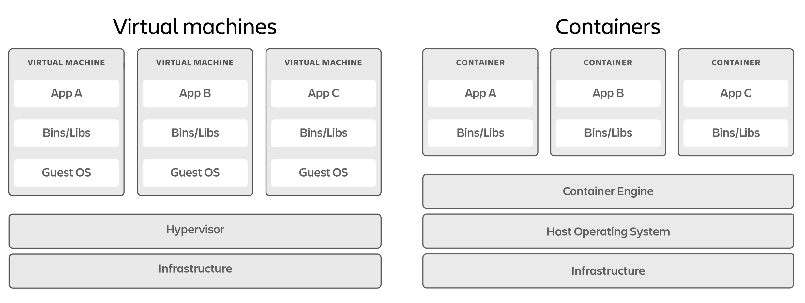

## Virtual Machines & Containers

In the world of virtualization and cloud computing, two primary technologies are widely used: **Virtual Machines (VMs)** and **Containers**. 
Both have their unique characteristics and different use cases. 
Understanding the differences between them is essential for choosing the right technology for your infrastructure needs.
Additional information and references can be found at the following link: [https://www.atlassian.com/microservices/cloud-computing/containers-vs-vms](https://www.atlassian.com/microservices/cloud-computing/containers-vs-vms)

### Virtual Machines

Virtual Machines (VMs) are software-based emulations of physical computers that run 
on a physical host machine.
Their main characteristics are:

1. **Hypervisor-Based**: VMs run on a hypervisor, which can be either Type 1 
(bare-metal) or Type 2 (hosted).
2. **Complete OS**: Each VM includes a full operating system (guest OS) along 
with the application and its dependencies.
3. **Isolation**: VMs provide strong isolation between different VMs as each VM runs 
a separate OS.
4. **Resource Allocation**: VMs require more system resources (CPU, memory, storage) 
because each VM runs its own OS.
5. **Boot Time**: VMs typically have longer boot times compared to containers 
because they need to boot the entire OS.

> [!NOTE]
> - Bare metal hypervisors: 
>   - VMs execute directly on the hardware, without the need of an underlying 
operating system. 
>   - They have direct access to underlying physical resources 
(CPU, RAM, memory, network). 
>   - Examples: VMware ESXi, MS Hyper-V, Xen, KVM. 
> - Host hypervisors: 
>   - VMs execute on top of an existing OS. It introduces some overhead. 
>   - Examples: VMware Workstation, VirtualBox, Parallels desktop.

VMs change the way we think about hardware and software and open up new 
possibilities for IT infrastructure.
They are widely used in various scenarios, including:

- Running applications that require strong isolation.
- Legacy application support that requires a specific OS.
- Multi-tenant environments where security and isolation are priorities.
- Running different operating systems on the same physical hardware.

### Containers

On the other hand, Containers are a form of operating system-level virtualization 
that allows multiple isolated **user-space instances** to run on a single host OS.
User-space instance means that each container runs as a separate process in the host OS, instead of booting a full OS like VMs.
This approach provides a lightweight and efficient way to run applications in isolated environments without the overhead of a full OS.
A container is a lightweight, standalone, and executable package that includes the application and its dependencies and 
that uses shared resources from the host OS and a layered file system. The main characteristics of containers are:

1. **Lightweight**: Containers share the host OS kernel and are much more lightweight than VMs.
2. **Fast Boot Time**: Containers can start almost instantly as they do not require booting an entire OS.
3. **Resource Efficiency**: Containers use fewer resources since they share the host OS and libraries.
4. **Portability**: Containers package the application and its dependencies, making them portable across different environments.
5. **Isolation**: Containers provide process-level isolation using namespaces and control groups (cgroups).

The rise of containers has transformed the way we develop, deploy, and manage applications.
In particular they enabled the following use cases:

- **Microservices architectures** where each service runs in its own container.
- **Continuous Integration/Continuous Deployment** (CI/CD) pipelines.
- **Running multiple instances** of the same application.
- **Developing and testing environments** due to easy reproducibility.

### Key Differences & Comments

Some of the main differences between Virtual Machines and Containers are summarized in the table below:

| Feature              | Virtual Machines                   | Containers                                            |
|----------------------|------------------------------------|-------------------------------------------------------|
| **Isolation**        | Full OS isolation                  | Process-level isolation                               |
| **Boot Time**        | Minutes                            | Seconds                                               |
| **Resource Usage**   | High (full OS per VM)              | Low (shared OS kernel)                                |
| **Performance**      | Lower due to overhead of hypervisor| Near-native performance                               |
| **Portability**      | Limited to hypervisor compatibility| High portability across environments                  |
| **Management**       | Requires hypervisor management     | Managed by container orchestrators (e.g., Kubernetes) |
| **Security**         | Strong isolation                   | Good isolation but depends on the host OS             |
---

Both Virtual Machines and Containers have their advantages and use cases. 
Virtual Machines provide strong isolation and are suitable for running multiple operating systems on the same hardware. 
Containers, on the other hand, are lightweight, fast, and ideal for microservices and environments where 
resource efficiency and portability are crucial.

Choosing between VMs and Containers depends on the specific needs of your application and infrastructure. 
In many modern applications, a combination of both technologies is used to leverage the strengths of each.

### Container History & First Experiments

>Computer containers are lightweight, portable, and executable software packages 
>that encapsulate applications and their dependencies, 
>ensuring consistent and efficient deployment across various computing environments.

The evolution of containers has been a significant milestone in software development and deployment practices.
Some of the main milestones in the history of containers are:
- **IBM VM/370** (1972): Introduced virtual machines (VMs) for running multiple operating systems on a single physical machine.
- **Linux VServers** (2001): Introduced lightweight virtualization for isolating processes and resources.
- **Solaris Containers** (2004): Provided operating system-level virtualization for Solaris systems.
- **FreeBSD Jails** (1999-2000): Introduced OS-level virtualization for FreeBSD systems.
- **Docker** (2013): Revolutionized containerization with a user-friendly platform for building, sharing, and running containers.
- *Kubernetes* (2014): Introduced container orchestration for managing and scaling containerized applications.

## Why to contain? 

- **Portability**: a container is comparable to an executable package. All relevant libraries are self-contained, can run on different systems (public or private cloud), a single deployment can be  moved from one environment to another with ease.
- **Agility**: containers support natively DevOps approaches. There is a high availability of basic container services, and most of the times is only needed to add *configurations* and *service-specific code*.  
- **Speed**: containers are *lightweight virtualization*. Sharing the same OS as host ensures fast startup time, no need to reboot OS for container restart, reduced overhead, lower costs because of the overall higher efficiency. 
- **Fault isolation**: each container is an *isolated* environment. Failures in one container do not affect other containers nor the host OS (e.g., faulty consumption of all available resources), supporting troubleshooting.
- **Efficiency**: related to speed. Lower overhead, faster access to resources, ...
- Ease of management: containers can be *orchestrated*. It means that their management can be automatized in activities such as installation, scaling, startup and shutdown. Several platforms allow for that, like the Docker Ecosystem or Kubernetes. 
- **Security**: in containers, it is *hard for malicious code to propagate*, because of *isolation*. Other containers are isolated from infected ones, as well as the host machine. Permissions management and resources limitations can prevent DoS attacks. 
