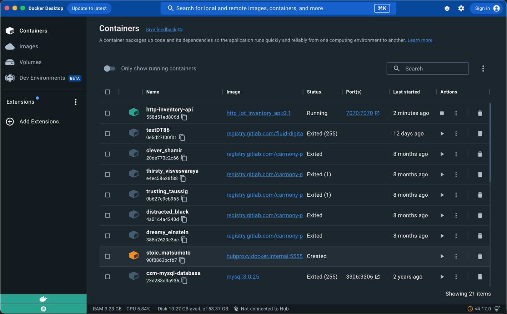
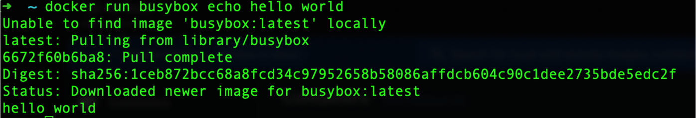
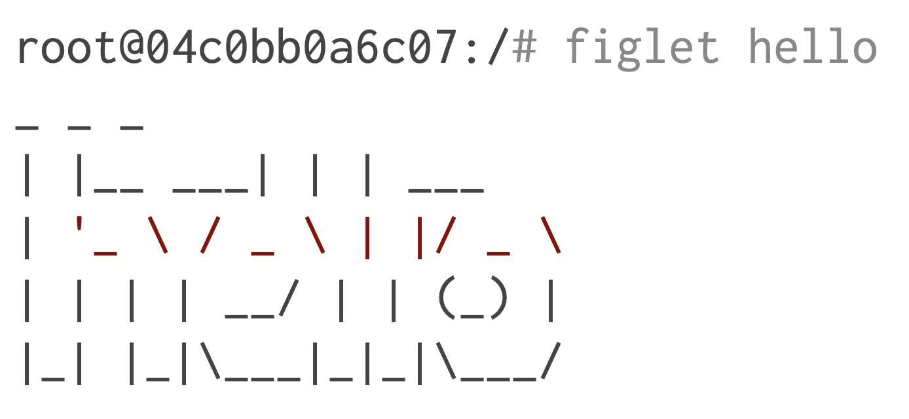

# Docker

## Docker: installation and first container

Docker is a leading platform for developing, shipping, and running applications in containers.
Its key Features are:
- **Containerization Simplified:** Offers an easy-to-use platform for creating, deploying, and running applications in containers.
- **Image-Based Packaging:** Utilizes Docker images, which package applications and their dependencies, ensuring consistency across different environments.
- **Efficient Resource Utilization:** Lightweight containers share the host OS kernel, minimizing resource overhead and maximizing efficiency.
- **Rapid Deployment:** Accelerates application delivery by enabling quick and consistent deployment across various infrastructure environments.

Docker  is now s a comprehensive platform encompassing tools, services, and a thriving ecosystem to manage the entire application lifecycle such as:

- **Docker Engine**: At its core, Docker Engine powers the creation and execution of containers, providing the fundamental technology for building and running applications.
- **Docker Images**: Docker introduces the concept of Docker Images — portable, consistent, and shareable packages that encapsulate an application and its dependencies.
- **Docker Desktop**: Docker Desktop, a user-friendly application, simplifies the development and deployment of containerized applications on local machines.
- **Docker Hub**: Docker Hub, a cloud-based registry, serves as a centralized repository for Docker Images, fostering collaboration and simplifying distribution across the developer community.
- **Docker Compose**: Docker Compose allows users to define and manage multi-container applications, facilitating complex setups and orchestrating the interaction between containers.
- **Docker Swarm**: Docker Swarm, a built-in orchestration tool, enables the management of a cluster of Docker hosts, ensuring scalability, load balancing, and fault tolerance.
- **Integration with Kubernetes**: Docker seamlessly integrates with Kubernetes, a leading container orchestration platform, providing users the flexibility to leverage Kubernetes' advanced features.

**We will use command line tools to learn foundational concepts, then if you want you can also use Docker Desktop :)**

### Installing Docker 

There are many ways to install Docker (Please check here: https://docs.docker.com/engine/install/).
We can arbitrarily distinguish:

- Installing ***Docker on an existing Linux machine*** (physical or VM)
- Installing ***Docker on macOS or Windows***
- Installing ***Docker on cloud VMs***

**Docker Desktop** available for Mac and Windows that is will Integrated with the host OS:
- installed like normal user applications on the host
- provides user-friendly GUI to edit Docker configuration and settings
- Only support running one Docker VM (with multiple containers) at a time

From an internal point of view Docker Desktop: 

- Leverages the host OS virtualization subsystem (e.g. the Hypervisor API on macOS)
- Under the hood, runs a tiny VM (transparent to our daily use)
- Accesses network resources like normal applications (and therefore, plays better with enterprise VPNs and firewalls)
- Supports filesystem sharing through volumes (we'll talk about this later)

An example of the Docker Desktop GUI is shown below:


<div align="center">
    
</div>
<div align="center">
    <figcaption>
        <em>Docker Desktop overview.</em>
        <br>
        <br>
    </figcaption>
</div>

### Create First Container

In your Docker environment, just run the following command:

```bash
docker run busybox echo hello world
```

The command will download the `busybox` image from the Docker Hub, create a container from it, and run the `echo hello world` command inside the container.

> [!NOTE]
>
> More information about the `busybox` image [here](https://hub.docker.com/_/busybox).

The result will be the output of the `echo` command, which is `hello world`.
If you don't have the `busybox` image locally, Docker will download it from the Docker Hub before creating the container.

The output of the command will be like:


<div align="center">
    
</div>
<div align="center">
    <figcaption>
        <em>Docker hello_world example.</em>
        <br>
        <br>
    </figcaption>
</div>


### Create an Ubuntu Container

Let's run a more exciting container:

```bash
docker run -it ubuntu
```

This is a brand new container.

It runs a bare-bones, with no additional software installed, Ubuntu Linux distribution.
Additional command line options assocaited to `-it` that is a combination of two options:

- **i** tells Docker to connect us to the container's stdin.
- **t** tells Docker that we want a pseudo-terminal on the target container

The results will be something like:

```bash
root@04c0bb0a6c07:/#
```

where `04c0bb0a6c07` is the container ID and `#` is the command prompt.
We now have a terminal inside the container and we can try to execute some linux commands

Try to run the figlet (a computer program that generates text banners, 
in a variety of typefaces, composed of letters made up of conglomerations of smaller ASCII characters) command in our container

```bash
root@04c0bb0a6c07:/# figlet hello
```

The output will be:

```bash
bash: figlet: command not found
```

This is because the `figlet` command is not installed in the Ubuntu container by default.
We can install it by running the following command to update the package list and install the `figlet` package:

```bash
root@04c0bb0a6c07:/# apt-get update
```

Now we can install the `figlet` package:

```bash
root@04c0bb0a6c07:/# apt-get install figlet
```

If you run the `figlet hello` command again:

```bash
root@04c0bb0a6c07:/# figlet hello
```

The output will be:


<div align="center">
    
</div>
<div align="center">
    <figcaption>
        <em>Docker figlet result example.</em>
        <br>
        <br>
    </figcaption>
</div>


Now we can exit the container by logging out of the shell, with **^D** or exit.
After the exit, try to run figlet again. Does that work? (It shouldn't; except if, by coincidence, you are running on a machine where figlet was installed before.)
The reasons are:

- We ran an ubuntu container on an Linux/Windows/macOS host.
- They have different, independent packages.
- Installing something on the host doesn't expose it to the container (And vice-versa).
- This is also true even if both the host and the container have the same Linux distro!
- We can run any container on any host. (One exception: Windows containers can only run on Windows hosts; at least for now.)

> [!NOTE]
> 
> More information about `docker run` [here](https://docs.docker.com/reference/cli/docker/container/run/).

## Experiment! 
>[!TIP]
> 
> Now you can try to do the same with another simple terminal program: `neofetch`. 
> 
> Additional information about `neofetch` can be found [here](https://github.com/dylanaraps/neofetch).
