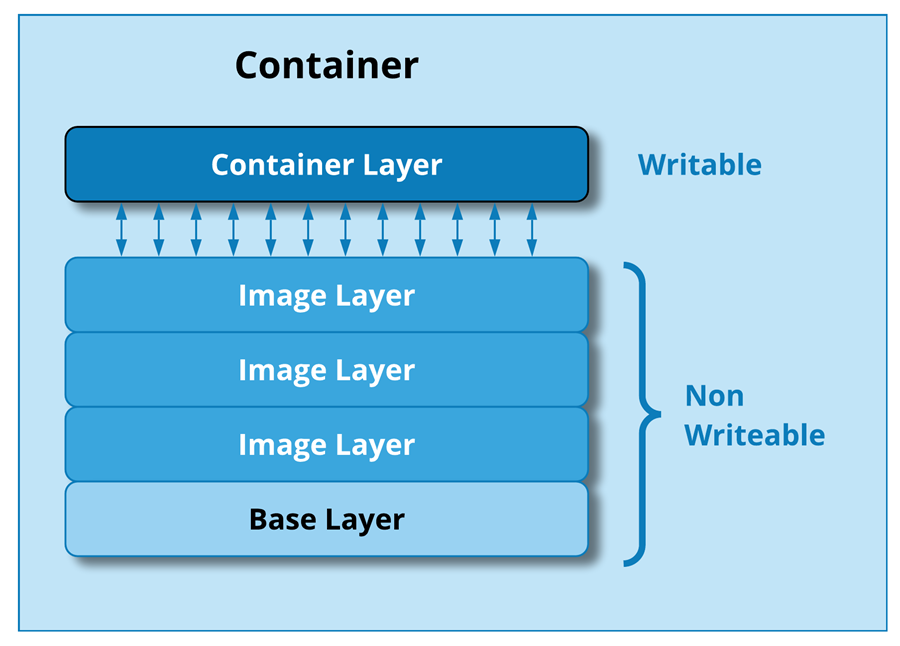
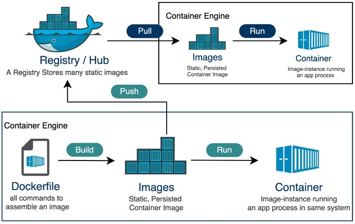
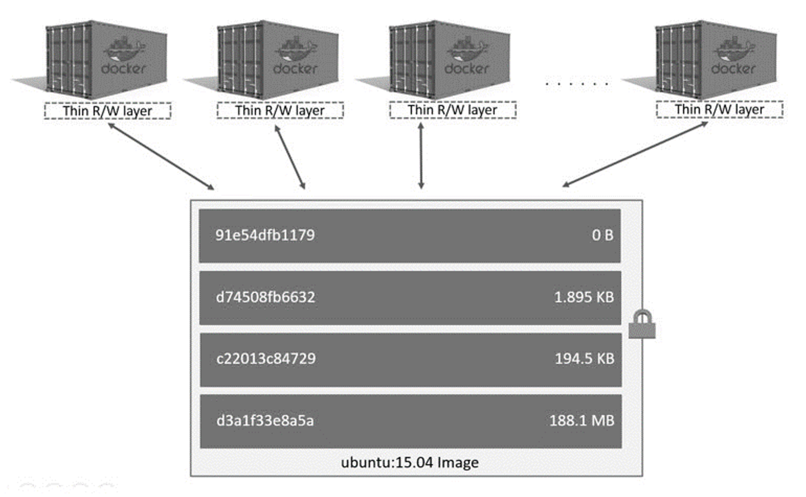
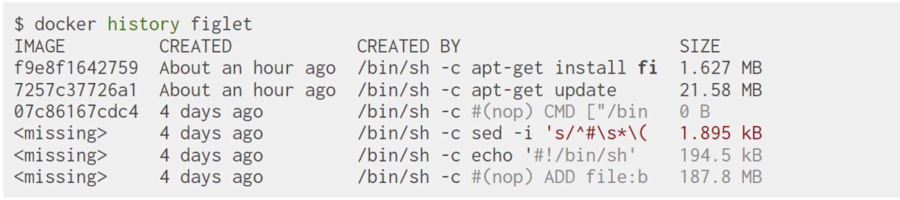

# Docker Images

Now that we have the basics of Docker containers, let's move on to Docker images in order to understand how they work and how to manage them.
Docker Image are a lightweight, standalone, and executable package that encapsulates all the necessary elements to run a piece of software, 
including the code, runtime, libraries, and system tools.
Docker images can be built from scratch or based on existing images available on Docker Hub or other container registries.
They are the building blocks of containers and provide a consistent environment for running applications across different environments.

Components of a Docker Image are:
- **Filesystem Snapshot**: A read-only snapshot of the filesystem with the application code, dependencies, and configurations.
- **Metadata**: Information about the image, including its name, version, and dependencies.

In order to to build a Docker image, we need to create a **Dockerfile**, which is a text file that contains a set of instructions for building the image.

Docker images have a **Layered Architecture**, where each instruction in the Dockerfile adds a new layer to the image.
This layered approach enables efficient caching, reusability, and smaller incremental updates.

A visual text based representation of the layered architecture is shown below:


<div align="center">
  
</div>
<div align="center">
    <figcaption>
        <em>Docker Image layered architecture.</em>
        <br>
        <br>
    </figcaption>
</div>


In the layered architecture, ***each instruction*** in the Dockerfile creates a ***new layer*** in the image.
When a new image is built, Docker ***reuses existing layers from the cache***, only rebuilding the layers that have changed.
We have the ***current container layer that is writable*** and can be modified during runtime. <!-- ? What does it mean? -->
The other layers are read-only and shared among multiple containers based on the same image.

For example, we can start from an Ubuntu image and add a new layer with the installation of our dependencies, and applications
such as using `Python`, `Java`, or `Node.js`.

The main management operations for Docker images are:

- **Build**: Create a new image from a Dockerfile.
- **Pull**: Download an image from a container registry.
- **Push**: Upload an image to a container registry.

You can build and keep your images locally, or you can push them to a container registry to share them with others or use them in different environments supporting the same containerization platform and simple deployment.

**Docker Registry** are services that store and distribute Docker images, allowing users to share and access images across different environments.
Those services can be public or private, and the most popular one is Docker Hub.

Each Image has a unique identifier called a **Digest**, which is a cryptographic hash of the image content.
The digest is used to verify the integrity of the image and ensure that it has not been tampered with.
Images can be versioned using **tags**, which are human-readable labels that point to specific versions or configurations of the image.
For example `latest`, `1.0`, or `stable`. A semantic versioning pattern is often used for tags, such as `1.2.3` or following a pattern like: `<major>.<minor>.<patch> (e.g., 1.2.3)`. 

A visual representation of the main Pull and Push concepts together with the idea of Docker registry is shown below ([Source](https://www.tutorialspoint.com/docker/docker_hub.htm)):


<div align="center">
  
</div>
<div align="center">
    <figcaption>
        <em>Docker workflow, from image creation to its deployment.</em>
        <br>
        <br>
    </figcaption>
</div>


## Containers vs Images

<!-- TODO: Transform the following bullet point into a table -->
- **Definition**:
  - *Docker Image*: A blueprint or snapshot that includes the application code, dependencies, libraries, and configurations. It is a static, immutable file used to create containers.
  - *Docker Container*: A running instance of a Docker image, encapsulating the application and its environment. Containers are dynamic, allowing for interaction and modification.
- **Purpose**:
  - *Docker Image*: Designed for distribution and sharing. It serves as a portable, self-sufficient package that can be run on any system.
  - *Docker Container*: Geared towards execution. It represents a lightweight, isolated environment where applications can run consistently across various environments.
- **Lifecycle**:
  - *Docker Image*: Static and unchanging once created. It serves as the foundation for one or more containers.
  - *Docker Container*: Dynamic and created from an image, runs applications, and can be stopped or removed without affecting the underlying image.
- **Mutability**:
  - *Docker Image*: Immutable. Any changes require creating a new image.
  - *Docker Container*: Mutable. Changes made during runtime, but those changes are lost once the container stops (unless committed to a new image).
- **Storage**:
  - *Docker Image*: Stored as layers in a registry (e.g., Docker Hub) and cached locally. Read-only.
  - *Docker Container*: Temporary storage in the container's writable layer. Read-write during runtime, changes persist until the container stops.

As a general rule of thumb, **images** are used for **distribution and sharing**, while **containers** are used for **execution and runtime environments**.

From the **same image** we then can create **multiple containers**, each with its own isolated environment and runtime characteristics as illustrated below:


<div align="center">
  
</div>
<div align="center">
    <figcaption>
        <em>Same Docker image, multiple Docker containers.</em>
        <br>
        <br>
    </figcaption>
</div>


## Object-Oriented Programming & Containers

It is possible to think of Docker containers as instances of a class in object-oriented programming.
In object-oriented programming, a **class is a blueprint** for creating objects (instances) that share common attributes and behaviors.
Some points associated with this analogy are:

- **Images vs. Classes**:
  - *Images (Containers)*: Conceptually similar to classes in Object-Oriented Programming (OOP).
  - *Explanation*: Images serve as blueprints or templates for containers, defining the application, dependencies, and configurations. They are static and represent the potential for creating multiple instances.
- **Layers vs. Inheritance**:
  - *Layers (Containers)*: Conceptually similar to inheritance in OOP.
  - *Explanation*: Layers in Docker images represent incremental changes. Each layer adds or modifies specific aspects, analogous to how inheritance allows new classes to inherit characteristics from existing classes, promoting code reuse and modification.
- **Containers vs. Instances**:
  - *Containers (Docker)*: Conceptually similar to instances in OOP.
  - *Explanation*: Containers are the dynamic, runnable instances created from Docker images. They represent the execution environment for applications, much like instances in OOP are specific occurrences of a class with unique states.

## Creating a New Image

To create a new image, we need to create a **Dockerfile** that contains the instructions for building the image.
A Dockerfile is a text file containing instructions for building a Docker image. 
It specifies the base image, desired configurations, and steps to set up the application.
The building Command is: 

```bash
docker build -t <image_name>:<tag> .
```

The structure of this command is:

- **docker build**: The command to build a new image.
- **-t**: The flag to tag the image with a name and optional tag.
- **<image_name>:<tag>**: The name and tag of the image.
- **.**: The build context, specifying the location of the Dockerfile and associated files.

An example Dockerfile is: 

```Dockefile
# Use an official base image
FROM ubuntu:latest

# Set the working directory
WORKDIR /app

# Copy Application Files & Requirements to /app
COPY ./app /app
COPY requirements.txt /app/requirements.txt

# Install dependencies
RUN apt-get update && apt-get install -y python3

# Install Python Application Requirements
RUN pip3 install -r requirements.txt

# Define the default command
CMD ["python3", "app.py"]
```

In this case we are using the `ubuntu` image as the base image, copying the current directory to the `/app` directory in the image,
setting the working directory to `/app`, installing Python 3, and running the `app.py` script when the container starts.

```Dockefile
# Use an official base image
FROM ubuntu:latest
```

This line specifies the base image for the new image.
In our case, we are using the latest version of the Ubuntu image as the base image.

```Dockefile
# Set the working directory
WORKDIR /app
```

The `WORKDIR` instruction sets the working directory for subsequent instructions in the Dockerfile.
This directory is used as the default location for running commands and storing files when the container is started.

```Dockefile
# Copy Application Files & Requirements to /app
COPY ./app /app
COPY requirements.txt /app/requirements.txt
```

The `COPY` instruction copies files or directories from the host machine to the container.
This operation is fundamental used to add application files and dependencies to the image.

```Dockefile
# Install dependencies
RUN apt-get update && apt-get install -y python3

# Install Python Application Requirements
RUN pip3 install -r requirements.txt
```

The `RUN` instruction executes commands in the container during the build process.
In our case we use the `apt-get` package manager to install Python 3 in the container since we would like to run a Python application.

> [!NOTE]
> 
> **There are already images with Python installed, but we are using this example to show how to install packages in the image.**

We use also the `RUN` command to install the Python application requirements using the `pip3` package manager and the 
requirements.txt file that we copied to the `/app` directory.

```Dockefile
# Define the default command
CMD ["python3", "app.py"]
```

The `CMD` instruction specifies the default command to run when the container starts.
In our case, we are running the `app.py` script using Python 3 as the default command.

Another option is to use the `ENTRYPOINT` instruction to specify the executable to run when the container starts.
CMD and ENTRYPOINT are both instructions in a Dockerfile that define the default command to be executed when a container starts. 
However, they serve slightly different purposes

- **CMD Instruction**:
  - The CMD instruction sets the default command and/or parameters for the container
  - If a Dockerfile has multiple CMD instructions, **only the last one takes effect**
  - CMD is typically used to provide default parameters for an executing container but **can be overridden** by specifying a command when running the container
- **ENTRYPOINT Instruction**:
  - The ENTRYPOINT instruction sets the executable to be run when the container starts
  - Unlike CMD, the ENTRYPOINT command and its parameters **are not ignored when a command is specified at runtime**
  - If a Dockerfile has multiple ENTRYPOINT instructions, **only the last one takes effect**
<!-- ? Richiede approfondimento -->

In summary, while both CMD and ENTRYPOINT can be used to define the default command, ENTRYPOINT is often used for specifying the main executable, 
while CMD provides default arguments that can be overridden at runtime

Other useful Dockerfile instructions are:

- **EXPOSE**: Specifies the port on which the container listens for incoming connections.
- **ENV**: Sets environment variables in the container.
- **VOLUME**: Creates a mount point for a volume in the container. (we will talk about volumes later)
- **USER**: Sets the user or UID to use when running the container.
- **LABEL**: Adds metadata to the image.
- **ARG**: Defines build-time variables.

As previously presented we can execute the docker build command to create the Docker image.

```bash
docker build -t myapp:latest .
```

The Docker image is built layer by layer, following the instructions in the Dockerfile
We can also Use the docker tag command to assign tags for versioning helping managing and track changes in the image over time.

```bash
docker tag myapp:latest myapp:v1.0
```

## Images History

To view the history of a Docker image, you can use the following command:

```bash
docker history <image_name>:<tag>
```


The output will be something like:


<div align="center">
  
</div>
<div align="center">
    <figcaption>
        <em>Docker image history.</em>
        <br>
        <br>
    </figcaption>
</div>


## Building & Caching

If you run the same build again, it will be instantaneous. Why?
After each build step, Docker takes a snapshot of the resulting image.
Before executing a step, Docker checks if it has already built the same sequence.
Docker uses the exact strings defined in your Dockerfile, so:

```bash
RUN apt-get install figlet cowsay
```

is different from

```bash
RUN apt-get install cowsay figlet
RUN apt-get update is not re-executed when the mirrors are updated <!-- ? Cosa significa? -->
```

You can force a rebuild with docker build `--no-cache` (e.g., `docker build --no-cache -t myapp:latest .`).

## Namespaces & Images Management

Docker uses namespaces to provide isolation and security for containers.
There are three main namespaces:
- **Official images**
  - The root namespace is for official images. 
  - They are gated by Docker Inc.
  - They are generally authored and maintained by third parties.
  - e.g. `ubuntu`, `mosquitto`, `busybox` ...
- **User (and organizations) images**
  - The user namespace holds images for Docker Hub users and organizations
  - *Docker Hub Username*: jpetazzo 
  - *Image Name*: clock
  - e.g. `jpetazzo/clock`
- **Self-hosted images**
  - This namespace holds images which are not hosted on Docker Hub, but on third party registries.
  - They contain the hostname (or IP address), and optionally the port, of the registry server.
  - e.g. `registry.example.com:5000/my-private/image`

Images can be stored:
- On your Docker host
- In a Docker registry

You can use the Docker client to download (pull) or upload (push) images.

>[!NOTE]
> 
> To be more accurate: you can use the Docker ***client*** to tell a Docker ***Engine*** to push and pull images to and from a registry.

There are different Docker Registries and you can also have your own registry for example using external services such as GitLab that provides the possibility to push and pull your container images on a dedicated registry with both private and public access.

## Listing Available Images

To list the available images on your Docker host, you can use the following command:

```bash
docker images
```

The output will be something like:

```bash
REPOSITORY     TAG    IMAGE ID     CREATED       SIZE
fedora         latest ddd5c9c1d0f2 3 days ago    204.7 MB
centos         latest d0e7f81ca65c 3 days ago    196.6 MB
ubuntu         latest 07c86167cdc4 4 days ago    188 MB
redis          latest 4f5f397d4b7c 5 days ago    177.6 MB
postgres       latest afe2b5e1859b 5 days ago    264.5 MB
alpine         latest 70c557e50ed6 5 days ago    4.798 MB
debian         latest f50f9524513f 6 days ago    125.1 MB
busybox        latest 3240943c9ea3 2 weeks ago   1.114 MB
training/namer latest 902673acc741 9 months ago  289.3 MB
jpetazzo/clock latest 12068b93616f 12 months ago 2.433 MB
```

## Searching for Images

We cannot list all images on a remote registry, but we can search for a specific keyword:
- **Stars**: indicate the popularity of the image.
- **Official**: images are those in the root namespace.
- **Automated**: images are built automatically by the Docker Hub. (This means that their build is always available.)

For example, to search for the `ubuntu` image, you can use the following command:

```bash
docker search ubuntu
```

The output will be something like:

```text
NAME                            DESCRIPTION                                     STARS   OFFICIAL
ubuntu                          Ubuntu is a Debian-based Linux operating s...   10469   [OK]
dorowu/ubuntu-desktop-lxde-vnc  Ubuntu with openssh-server and NoVNC            126
rastasheep/ubuntu-sshd          Dockerized SSH service, built on top of of...   108     [OK]
consol/ubuntu-xfce-vnc          Ubuntu container with "headless" VNC sessi...   107
ubuntu-upstart                  Upstart is an event-based replacement for ...   73      [OK]
ansible/ubuntu14.04-ansible     Ubuntu 14.04 LTS with ansible                   100
ubuntu-debootstrap              debootstrap --variant=minbase --components...   26      [OK]
nuagebec/ubuntu                 Simple always updated Ubuntu docker images...   24      [OK]
```

## Downloading Images

Images can be built from scratch or pulled from a registry.
Downloading an image is called pulling an image.
This process downloads the image from a registry to your local Docker host in order to create containers from it and run applications.

There are two ways to download images: 
- **Explicitly**, with **docker pull**
- **Implicitly**, when executing **docker run** and the image is not found locally.

To pull an image explicitly, you can use the following command:

```bash
docker pull <image_name>:<tag>
```

For example, to pull the `ubuntu` image with the `latest` tag, you can use the following command:

```bash
docker pull ubuntu:latest
```

The output will be something like:

```bash
latest: Pulling from library/ubuntu
d0e7f81ca65c: Pull complete
07c86167cdc4: Pull complete
07c86167cdc4: Pulling metadata
07c86167cdc4: Pulling fs layer
07c86167cdc4: Download complete
```

As you can see, the image is pulled from the `library/ubuntu` repository, which is the default repository for official images.
And layers are downloaded one by one and then the image is downloaded and ready to be used.

## Images and Tags

Images can have tags to differentiate between different versions or configurations of the same image.
Tags define image versions or variants.
Without a tag, Docker will assume the `latest` tag by default.
For example `docker pull ubuntu` will refer to `ubuntu:latest`. The :latest tag is generally updated often.
As best practice we can follow some (simple) guidelines for tagging images:

- **Don't specify tags**:
  - When doing *rapid testing* and *prototyping*.
  - When *experimenting*.
  - When you *want* the latest version.
- **Do specify tags**:
  - When recording a procedure into a script.
  - When going to ***production***.
  - To ensure that the ***same version*** will be used everywhere.
  - To ensure ***repeatability*** later.

This is similar to what we would do with pip install, npm install, etc.

## Images and Multiple Architectures

Docker images can be built for different architectures.
For example, an image can be built for both x86 and ARM architectures or it can be built for a specific architecture.
When pulling an image, Docker will **automatically pull the image for the architecture of the host machine**.
This topic is relevant when working with multi-architecture environments or when building images for specific platforms.
For example recent Raspberry Pi models use ARM architecture and we need to build images for ARM architecture.

Docker uses **tags to specify the architecture** of an image.
For example `ubuntu:latest` is the image for the x86 architecture, while `ubuntu:arm64` is the image for the ARM64 architecture.
We can also refer to the architecture in the image name, such as `arm64v8/ubuntu:latest` through the following command:

```bash
docker pull arm64v8/ubuntu:latest
```

or using the --platform flag:

```bash
docker pull --platform linux/arm64 arm64v8/ubuntu:latest
```

## Let's Experiment!
Test the viewed commands using the command line or the command line offered by Docker Desktop!
