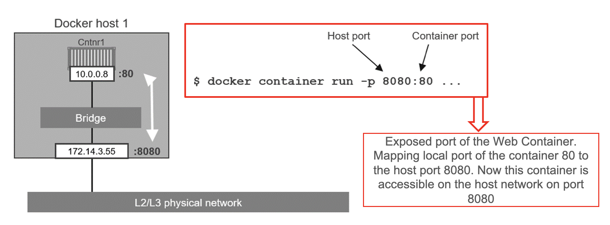
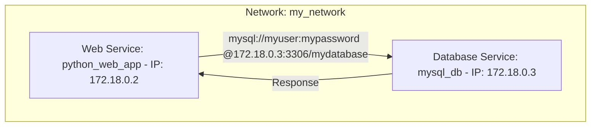
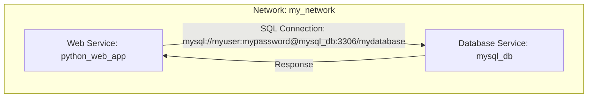

## Docker Networking & Volumes
## Networking

Containers run in isolated environments but may need to communicate with each other or external systems.
Docker uses built-in networking features to enable communication between containers and the outside world.

Networking on Docker and in general with containers is a complex topic and here we are going to introduce some basic concepts.
Additional notes and concepts about Docker networking can be found on the official web site at the following link: 
[https://docs.docker.com/engine/network/](https://docs.docker.com/engine/network/)

When a Docker container is created, it is connected to the default *bridge network*
  - **Bridge Network** Characteristics:
    - Containers on the same bridge network can communicate with each other
    - Containers on different bridge networks are isolated by default
  - Each Container has an IP: Containers on the same network have unique IP addresses. Example: 172.17.0.2, 172.17.0.3, etc
  - Port Mapping: Use `-p` or `--publish` to map container ports to host ports, enabling external access.
  - Example: `docker run -p 8080:80 mywebapp`

The port mapping allows the container to **be accessed from the host machine** using the specified port.
The `p` or `--publish` flag is used to map container ports to host ports, enabling external access.
For example, the command `docker run -p 8080:80 mywebapp` maps port 80 in the container to port 8080 on the host machine.
The port can be the same or different on the host and container in this way we can have multiple containers running on the same host machine or
customize the port mapping for different services or on different environments.

A visual representation of the default bridge network is shown below:



The bridge allows containers to communicate with each other, but ***not with the host machine or external systems***. <!-- ? Contraddice il punto sotto? -->
For example in the previous example, the container can be accessed from the host machine using the `localhost:8080` address.

Some additional notes and concepts about Docker networking are:

- **Host Localhost**:
  - On a traditional host machine, "localhost" typically refers to the loopback network interface (IP address 127.0.0.1).
  - This loopback interface allows processes on the host to communicate with each other locally without going through the network stack.
- **Container Localhost**:
  - When you run a container, it has its own isolated network namespace. Inside the container, the loopback interface also exists, and ***"localhost" refers to the container itself***.
  - **Containers have their own IP addresses, and the loopback interface inside a container points to the container's IP address.** <!-- ? Conseguenze? -->
- **Host-to-Container Communication**:
  - By default, containers can communicate with the host and each other through their respective IP addresses.
  - If a service inside a container is exposed on a specific port, you can access it from the host machine using the container's IP address and the mapped port.
- **Using "localhost" Inside a Container**:
  - If a process inside a container tries to connect to "localhost," it refers to the loopback interface within the container itself.
  - This can be problematic *if the process expects to connect to a service running on the host's loopback interface*.
- **Solutions and Considerations**:
  - To access services running on the host from inside a container, you might need to use the host machine's IP address.
  - Alternatively, using the **special hostname** `host.docker.internal` (available on Docker for Windows, Docker for Mac, and Docker Desktop) allows containers to reach services on the host. <!-- ? E su Linux?-->

In Docker multiple virtual networks can be created to isolate containers and control communication between them.
We can have the following main configurations: 

- **Default Bridge Network:** Docker creates a default bridge network when you run containers without specifying a network.
  - `docker run -d --name container1 myimage1`
  - `docker run -d --name container2 myimage2`
- **Custom Bridge Network:** You can create a custom bridge network using docker network create and then connect containers to it.
  - `docker network create mynetwork`
  - `docker run -d --name container1 --network=mynetwork myimage1`
  - `docker run -d --name container2 --network=mynetwork myimage`
- **Host Networking Mode:** Use the host networking mode to share the host's network stack.
  - `docker run -d --network host myimage`

The host networking mode allows the container to share the host's network stack, including the IP address and network interfaces.
This mode can be useful when you want to run a container that requires access to the host's network configuration or services.
It is not the best practice because it can expose the container to potential security risks but it can be useful in some specific cases.

**If two containers are connected to the same network, they can communicate with each other using the service name as the hostname.
This is fundamental and avoids the need to use IP addresses to communicate between containers.**
Two container on the default bridge network can communicate with each other using the container name as hostname.

Without the use of the same network and using IP addresses, the communication between containers can be complex and error-prone.
If two containers are not using service names, they must communicate using IP addresses. This can be less flexible as IP addresses may change.
For example in this scenario:



The Web Service container needs to know the IP address of the Database Service container to establish a connection.
**If the IP address changes, the Web Service container must be updated with the new IP address.**

Using the same network and service names, the communication between containers is simplified and more flexible.
The same scenario can be represented as follows:



More information present in this [notes](../assets/docs/docker_notes.pdf).

### Volumes

Docker volumes are used to persist data generated by and used by Docker containers.
Like networking is a complex topic and here we are going to introduce some basic concepts.
Additional notes and concepts about Docker can be found on the official web site at the following link
[https://docs.docker.com/engine/storage/volumes/](https://docs.docker.com/engine/storage/volumes/).

Why use volumes?
- **Persistence:** Data stored in volumes persists beyond the lifecycle of the container, ensuring that valuable information is not lost when a container stops or is removed
- **Shared Data:** Volumes facilitate the sharing of data among containers, promoting collaboration and efficient data management

In this playground we refer to the **Host Bind Mounts:** allow us to mount a directory from the host machine into a container. 
They provide a way to share data between the host and the container. 

Volumes can also be created using the -v option during container creation
For example: 

```bash
docker run -v mydata:/app/data myimage
```

This command uses a local folder called `mydata` and mounts it to the `/app/data` directory in the container.
In this way the data is shared between the host and the container.
This kind of volumes can be used for example to: 
- Share configuration files between the host and the container (e.g., configuration to handle MQTT connection parameters)
- Share data between the host and the container (e.g., data generated by the application)
- Share logs between the host and the container (e.g., logs generated by the application)
- Share code between the host and the container (e.g., code to be executed by the application) during the development phase
- Share folder to persist data generated by the application or databases containers (a MySql database, a MongoDB database, etc.)

More information present in this [notes](../assets/docs/docker_notes.pdf).
